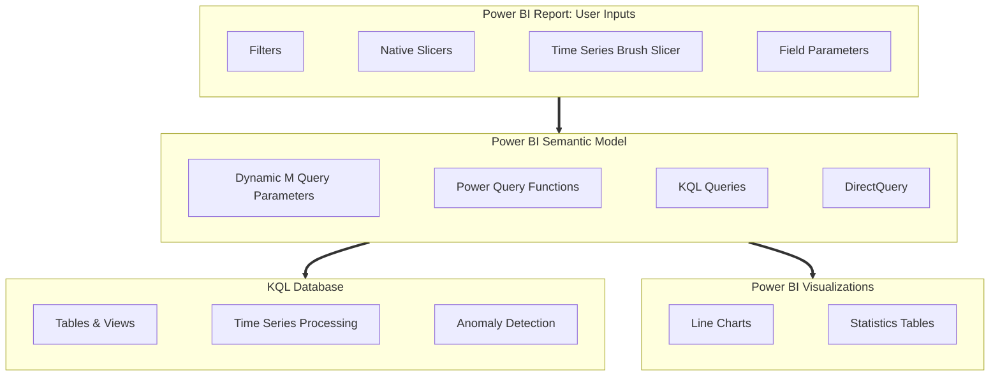
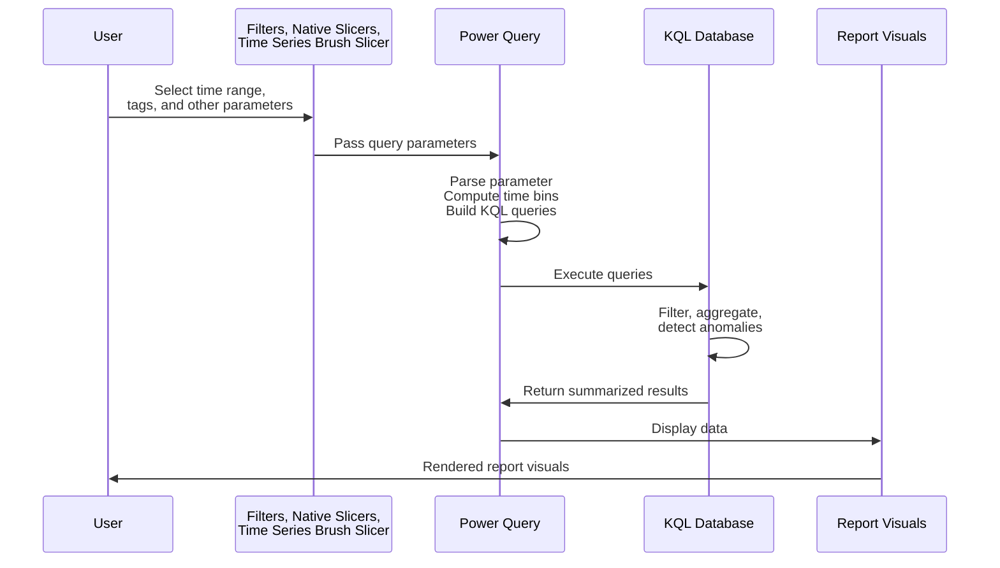

# Architecture

This page describes the architecture and data flow of the Time Series Visualization solution.

## Solution Components

## Key Component Details

### [KQL Database](https://learn.microsoft.com/en-us/kusto/query/time-series-analysis?view=microsoft-fabric)

The KQL Database (in Microsoft Fabric or Azure Data Explorer) provides:

- Highly scalable storage for time series data
- Performant query execution with native time series functions
- Server-side processing for filtering, aggregation, and anomaly detection

### [Power BI Semantic Model](https://learn.microsoft.com/power-bi/connect-data/desktop-directquery-about)

The semantic model operates in DirectQuery mode, which means:

- Queries are executed in real-time against the KQL database
- No data is imported or cached in Power BI
- Changes to source data are immediately reflected

### [Dynamic M Query Parameters](https://learn.microsoft.com/en-us/power-bi/connect-data/desktop-dynamic-m-query-parameters)

Power BI's Dynamic M Query Parameters enable:

- Passing user inputs from filters and slicers to Power Query
- Constructing custom KQL queries based on user selections
- Efficient filtering at the data source level

### [Power Query Functions](https://learn.microsoft.com/power-query/custom-function)

Custom Power Query functions handle:

- Parsing parameter values from the brush slicer
- Computing optimal time bin sizes
- Constructing well-formed KQL queries
- Handling edge cases and data validation

### [Field Parameters](https://learn.microsoft.com/power-bi/create-reports/power-bi-field-parameters)

Power BI Field Parameters allow end users to:

- Customize chart layouts dynamically
- Choose which metrics to display
- Configure small multiples and legends

### [Time Series Brush Slicer](https://github.com/slavatrofimov/Time-Series-Brush-Slicer)

The custom visual provides:

- Interactive time range selection
- Visual context for the full time period
- Anomaly and marker highlighting
- Smooth brushing experience

### [Power BI Report](https://learn.microsoft.com/en-us/power-bi/create-reports/) 
Power BI reports offer rich and highly-interactive data visualization experiences.
- Wide variety of visuals, such as tables and line charts
- Interactive cross filtering and cross highlighting
- Intuitive layout and formatting options

## Data Flow

### How Power BI Works with the KQL Database

Note: this data flow is *iterative* -- it is repeated every time a user provides inputs via filters, native slicers or the custom Time Series Brush Slicer. 

### Step-by-Step Flow
0. **User provides initial inputs** using Power BI report filters and slicers, including the Time Series Brush Slicer custom visual
1. **User selects a time range** by brushing on the visual
2. **The visual outputs a text parameter** with your selected dates
3. **Power Query parses the parameter** and builds a KQL query with filters
4. **KQL Database processes everything** at the source—filtering, aggregating, detecting anomalies
5. **Only the results come back** to Power BI, not the raw data
6. **Power BI renders visuals** and allows the user to continue exploration.

## Why This Architecture Is Fast

| Optimization | Description |
|--------------|-------------|
| **Filtered at source** | The KQL database only processes data in your selected time range |
| **Server-side processing** | Aggregations, binning, and calculations happen in the highly-performant KQL database |
| **Minimal data transfer** | Only summarized results flow to Power BI |
| **Automatic optimization** | The report adjusts time granularity based on your selections |

## Scalability

This architecture can handle:

- **Billions of data points** through intelligent binning
- **Multiple concurrent users** by querying highly-scalable KQL Databases in DirectQuery mode
- **Real-time data** without refresh delays
- **Large tag hierarchies** with efficient metadata queries

## Security Considerations

- Authentication uses [Microsoft Entra ID](https://learn.microsoft.com/en-us/entra/fundamentals/what-is-entra)
- Benefit from extensive [security features in Microsoft Fabric](https://learn.microsoft.com/en-us/fabric/security/security-overview)
- [Row-level security](https://learn.microsoft.com/en-us/kusto/management/row-level-security-policy?view=microsoft-fabric) can be implemented in the KQL database