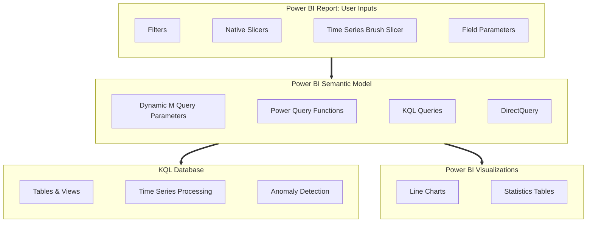
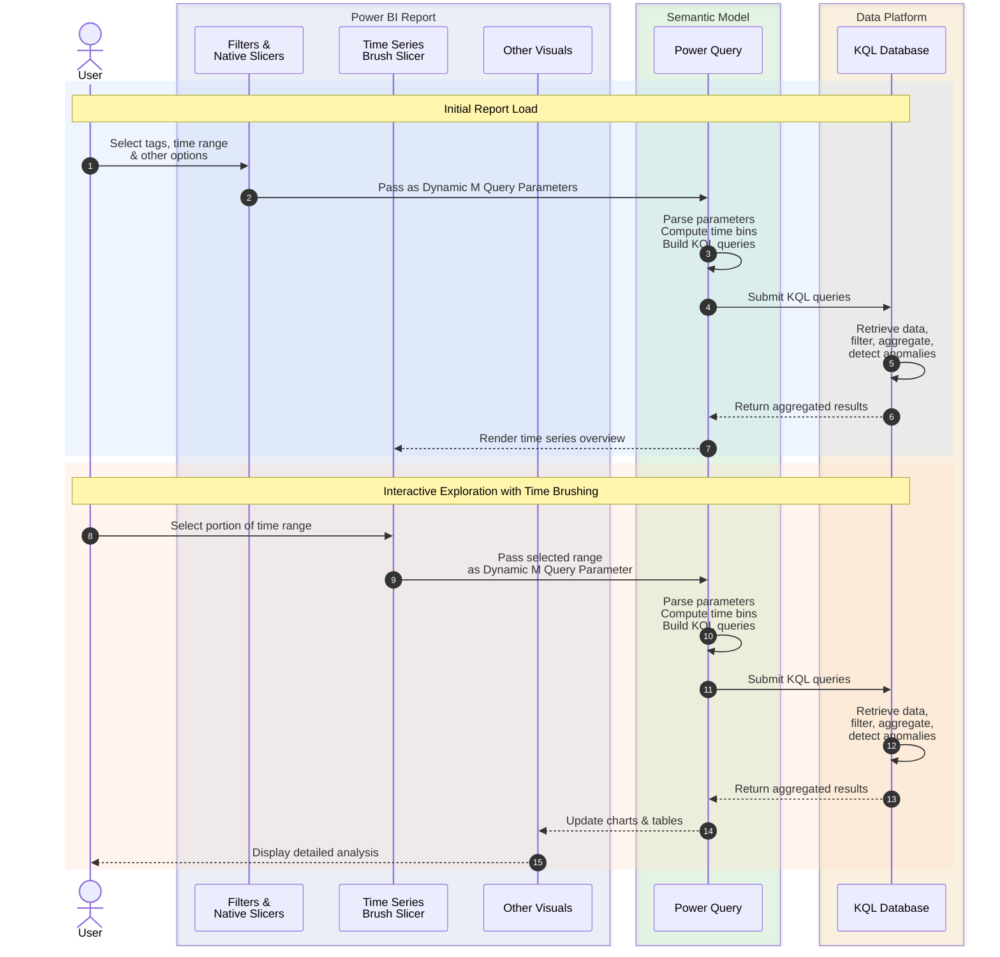

# Architecture

This page describes the architecture and data flow of the Time Series Visualization solution.

## Solution Components

## Key Component Details

### [KQL Database](https://learn.microsoft.com/en-us/kusto/query/time-series-analysis?view=microsoft-fabric)

The KQL Database (in Microsoft Fabric or Azure Data Explorer) provides:

- Highly scalable storage for time series data
- Performant query execution with native time series functions
- Server-side processing for filtering, aggregation, and anomaly detection

### [Power BI Semantic Model](https://learn.microsoft.com/power-bi/connect-data/desktop-directquery-about)

The semantic model operates in DirectQuery mode, which means:

- Queries are executed in real-time against the KQL database
- No data is imported or cached in Power BI
- Changes to source data are immediately reflected

### [Dynamic M Query Parameters](https://learn.microsoft.com/en-us/power-bi/connect-data/desktop-dynamic-m-query-parameters)

Power BI's Dynamic M Query Parameters enable:

- Passing user inputs from filters and slicers to Power Query
- Constructing custom KQL queries based on user selections
- Efficient filtering at the data source level

### [Power Query Functions](https://learn.microsoft.com/power-query/custom-function)

Custom Power Query functions handle:

- Parsing parameter values from the brush slicer
- Computing optimal time bin sizes
- Constructing well-formed KQL queries
- Handling edge cases and data validation

### [Field Parameters](https://learn.microsoft.com/power-bi/create-reports/power-bi-field-parameters)

Power BI Field Parameters allow end users to:

- Customize chart layouts dynamically
- Choose which metrics to display
- Configure small multiples and legends

### [Time Series Brush Slicer](https://github.com/slavatrofimov/Time-Series-Brush-Slicer)

The custom visual provides:

- Interactive time range selection
- Visual context for the full time period
- Anomaly and marker highlighting
- Smooth brushing experience

### [Power BI Report](https://learn.microsoft.com/en-us/power-bi/create-reports/) 
Power BI reports offer rich and highly-interactive data visualization experiences.
- Wide variety of visuals, such as tables and line charts
- Interactive cross filtering and cross highlighting
- Intuitive layout and formatting options

## End-to-End Interaction Flow

### Interaction Flow Diagram

This diagram shows how user interactions with the Power BI report trigger interactions between key components of the solution. Considering the iterative nature of interactive analytics, this sequence of steps will be repeated as the user continues to change and refine the focus of their time series exploration.

### Interaction Flow Details

This section provides additional details and context about each step in the interaction flow between the user, the report, and other components of the solution. 

!!! tip "Use with the interaction flow diagram"
    These numbered steps correspond to the numbers shown on the preceding interaction flow diagram.

1. **User configures initial report selections** — The user selects assets/tags, defines a time range, and sets aggregation options using Power BI's native filters and slicers. These selections determine the scope of data to analyze.

2. **Parameters flow to Power Query** — Each slicer and filter is bound to a Dynamic M Query Parameter. When the user makes a selection, Power BI report passes these values to the Power Query engine in the semantic model.

3. **Power Query constructs optimized KQL queries** — Custom Power Query functions parse the incoming parameters and dynamically build KQL queries. This includes computing optimal time bin sizes based on the selected range (e.g., 1-minute bins for a 1-hour window, 1-hour bins for a 1-month window) to keep result sets manageable.

4. **Power Query submits queries to the KQL database** — Custom KQL queries constructed in the previous step are submitted to the KQL database.

5. **KQL Database executes queries** — The query runs entirely within the KQL database, leveraging native time series functions like `make-series`, `series_decompose_anomalies`, and `summarize`. Filtering, aggregation, and anomaly detection all happen at the source.

6. **Aggregated results return to Power BI** — Only the processed, summarized results are transferred to Power BI. For a million-point time series, this might be just a few hundred aggregated bins.

7. **Time Series Brush Slicer renders the overview** — The time series brush slicer displays data for the full time range, providing visual context and enabling the user to identify periods of interest.

8. **User brushes to select a narrower time range** — By clicking and dragging on the time series brush slicer, the user selects a specific portion of the time range for detailed analysis. The slicer outputs the start and end timestamps of the selected range as a formatted text string.

9. **Selected range is passed to the Power Query engine** — The time series brush slicer's output is bound to a Dynamic M Query Parameter, which triggers Power Query to rebuild relevant KQL queries with the narrower time window.

10. **Power Query constructs optimized KQL queries** — Power Query parses the incoming parameters and dynamically builds KQL queries that reflect the selected time window. Because the time range is smaller, Power Query calculates a finer time granularity (smaller bins), returning more detailed data for the selected period while still keeping the result set manageable.

11. **Power Query submits queries to the KQL database** — Custom KQL queries constructed in the previous step are submitted to the KQL database.

12. **KQL Database executes queries** — Queries for the selected time range are executed on the KQL database, leveraging native time series functions as well as filtering and aggregation capabilities.

13. **Finer-grained data returns to Power BI** — Summarized and enriched results for the selected time period return from the KQL database to Power BI

14. **Updated data is delivered to report visuals** — Line charts, statistics tables, and other visuals receive the updated finer-grained data.

15. **Report visuals are rendered to enable detailed analysis** — Power BI report visuals are re-rendered to  show the detailed view of the selected time range, including any detected anomalies highlighted for investigation.

16. **User continues exploration** — The user can further refine selections, change tags, adjust time ranges, or drill into anomalies, with each interaction repeating this efficient interaction cycle.

## Why This Architecture Is Fast

| Optimization | Description |
|--------------|-------------|
| **Filtered at source** | The KQL database only processes data in your selected time range |
| **Server-side processing** | Aggregations, binning, and calculations happen in the highly-performant KQL database |
| **Minimal data transfer** | Only summarized results flow to Power BI |
| **Automatic optimization** | The report adjusts time granularity based on your selections |

## Scalability

This architecture can handle:

- **Billions of data points** through intelligent binning
- **Multiple concurrent users** by querying highly-scalable KQL Databases in DirectQuery mode
- **Real-time data** without refresh delays
- **Large tag hierarchies** with efficient metadata queries

## Security Considerations

- Authentication uses [Microsoft Entra ID](https://learn.microsoft.com/en-us/entra/fundamentals/what-is-entra)
- Benefit from extensive [security features in Microsoft Fabric](https://learn.microsoft.com/en-us/fabric/security/security-overview)
- [Row-level security](https://learn.microsoft.com/en-us/kusto/management/row-level-security-policy?view=microsoft-fabric) can be implemented in the KQL database